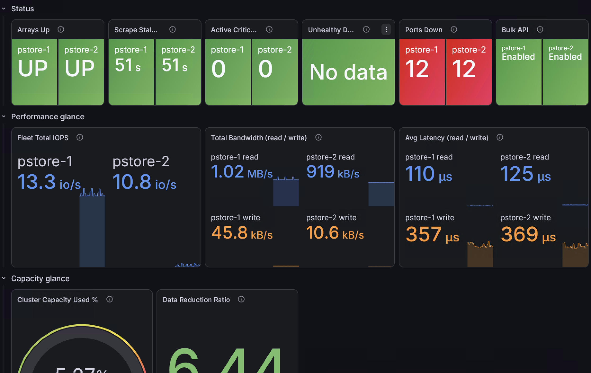
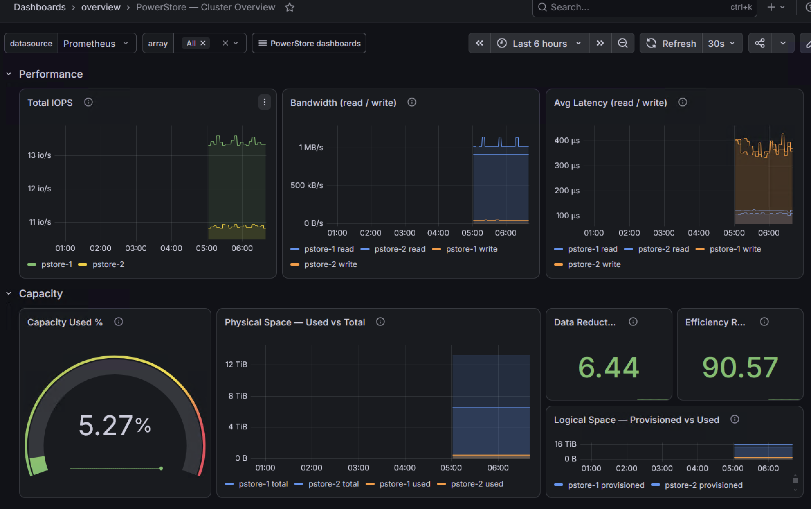
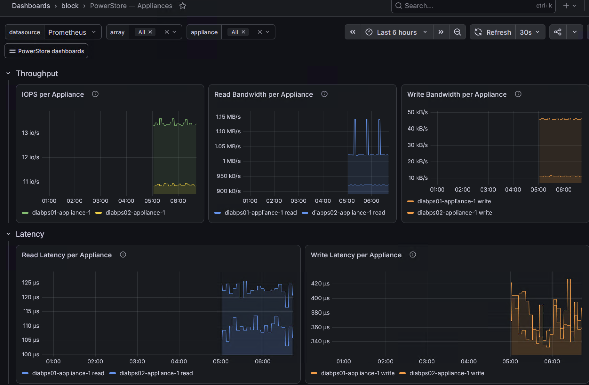
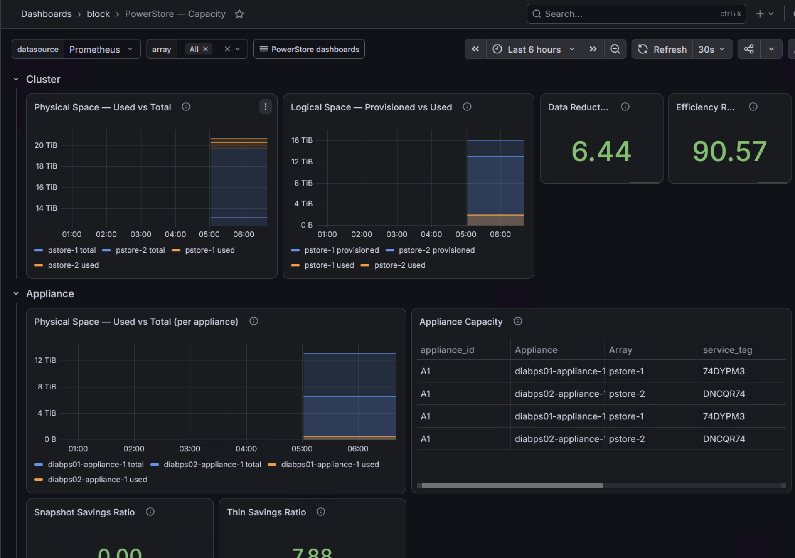
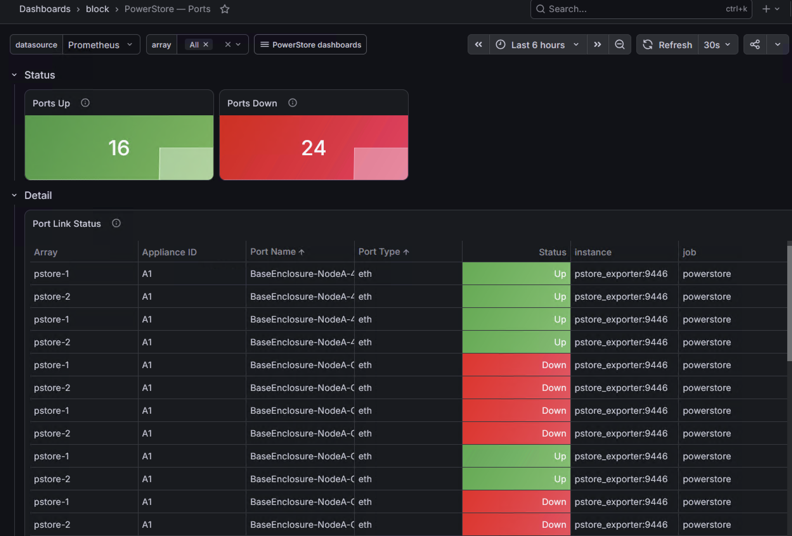
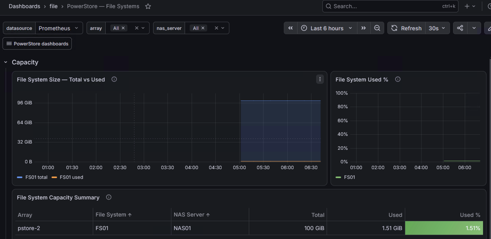
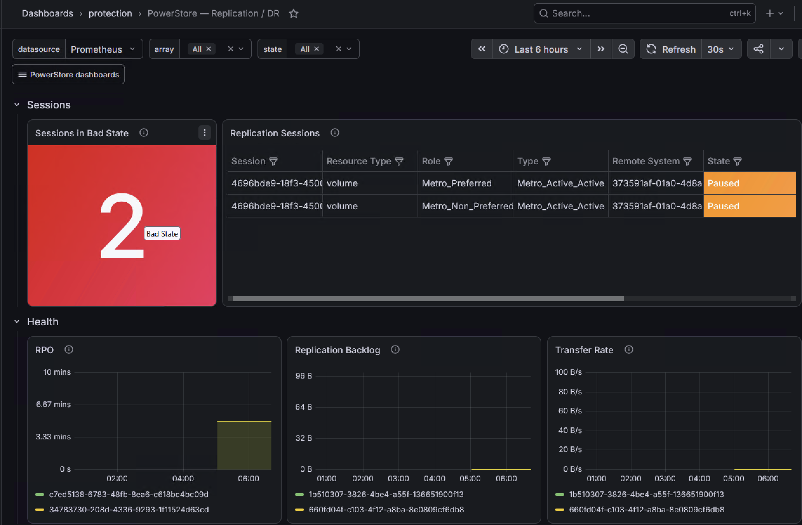
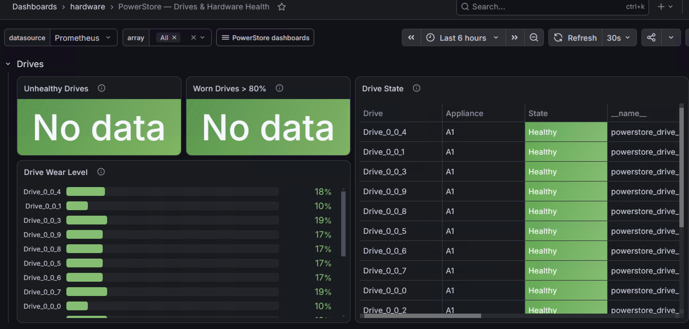

# Dashboards

Importable Grafana dashboards (PromQL) live under `grafana/dashboards/`. Each
subdirectory becomes a Grafana folder (the provisioning provider uses
`foldersFromFilesStructure: true`), and the whole tree is mounted with a single
docker-compose volume:

- `overview/` — `00-fleet-health` (health/alerts/staleness landing + drill links) and
  `01-cluster-overview` (fleet performance + capacity rollup).
- `block/` — `02-appliances`, `03-volumes`, `04-volume-groups`, `05-capacity`,
  `06-ports`.
- `file/` — `01-file-systems` (capacity + performance).
- `protection/` — `01-replication` (DR session state, RPO, backlog, transfer rate).
- `hardware/` — `01-drives` (drive state, wear level, active alerts).

Every dashboard shares one design system: a `datasource` + `array` template variable
(`label_values(powerstore_up, array)`, multi/All), collapsible rows, consistent units
and thresholds, fixed read=blue / write=orange series colors, and a tag-based dashboard
links dropdown (`powerstore`) plus data links that drill down carrying `$array`.

## Gallery

### overview / 00-fleet-health

Landing page: per-array `up` state, scrape staleness, active critical alerts, ports down,
bulk-API capability, plus performance and capacity glances with drill-down links.



### overview / 01-cluster-overview

Fleet performance (IOPS, bandwidth, latency) and capacity rollup per array.



### block / 02-appliances

Per-appliance throughput and latency, filtered by the `$array` and `$appliance` variables.



### block / 05-capacity

Cluster and per-appliance physical/logical space, data reduction, efficiency, snapshot and
thin savings ratios.



### block / 06-ports

Ports up/down counters and a per-port link-status table.



### file / 01-file-systems

File system size, used %, and a capacity summary table per NAS server.



### protection / 01-replication

Replication session state (including Metro), RPO, backlog, and transfer rate.



### hardware / 01-drives

Drive state, wear level, unhealthy and worn-drive counters.



## Import

In Grafana: **Dashboards → New → Import**, upload the JSON, and select your Prometheus
data source. Each dashboard uses a `$array` template variable (and the appliance dashboard
also an `$appliance` variable).

## PromQL conventions

- Metrics are gauges; `array`, `appliance_name`, `volume_name`, etc. let you filter per object.
- `iops` and `bandwidth_bytes_per_second` are **pre-derived per-second** values — aggregate
  with `sum`/`avg by (...)`, **never** `rate()`.

Examples:

```promql
# Total read IOPS across all volumes for the selected array
sum by (volume_name) (powerstore_volume_read_iops{array=~"$array"})

# Appliance efficiency over time
powerstore_appliance_efficiency_ratio{array=~"$array", appliance_name=~"$appliance"}

# File system fill rate
100 * powerstore_file_system_size_used_bytes{array=~"$array"}
    / powerstore_file_system_size_total_bytes{array=~"$array"}

# Busiest volumes by total IOPS
topk(10, sum by (volume_name) (powerstore_volume_total_iops{array=~"$array"}))
```

## Panel conventions

These rules are enforced by `go test ./internal/dashboards/` and therefore by `make ci`.
See [ADR-0016](adr/0016-per-array-rendering-and-series-colour.md).

**Group by `array`.** Every aggregating expression carries a `by (...)` clause including
`array`, and legends as `{{array}}`. A bare `avg(...)` or `sum(...)` blends every selected
array into one unattributable number.

**Never let a healthy array vanish.** `powerstore_drive_state` and
`powerstore_replication_session_state` are info series whose value is always `1`; a healthy
array matches no series and its tile disappears. Zero-fill with `powerstore_up`, whose only
label is `array`:

    sum by (array) (powerstore_drive_state{array=~"$array",state!="Healthy"})
      or sum by (array) (powerstore_up{array=~"$array"} * 0)

For numeric comparisons use the `bool` modifier instead, which keeps the series:

    sum by (array) (powerstore_port_link_up{array=~"$array"} == bool 0)

`powerstore_alert_active` already emits a stable zero series per known severity and needs
neither treatment.

**Hue is identity, line style is direction.** Timeseries panels set
`"color": {"mode": "palette-classic-by-name"}`. Hue is derived deterministically from each
series' name, so within any panel every array or appliance is distinguishable and its colour
is stable across refreshes — but the hash includes the ` read`/` write` suffix and legends
differ between panels, so the same entity is not guaranteed the same hue on a different panel
or dashboard. Direction is shown by line style — read solid, write dashed via a `/ write$/`
override setting `custom.lineStyle`. Panels whose colour encodes a threshold rather than an
identity — CPU utilisation, drive wear, the capacity gauges — keep
`"color": {"mode": "thresholds"}`.

## Building more

The dashboards follow the [metric naming scheme](metrics.md); new panels can be built
mechanically from it. Remember that all values use explicit units:
`_bandwidth_bytes_per_second`, `_latency_microseconds`, `_bytes`.

## Node Exporter Full (Grafana 1860)

This repo bundles the community [Node Exporter Full](https://grafana.com/grafana/dashboards/1860-node-exporter-full/)
dashboard (`node-exporter-full.json`, auto-provisioned). It visualizes **host OS** metrics
(CPU, memory, disk, network) exposed by [`prom/node-exporter`](https://hub.docker.com/r/prom/node-exporter) —
**not** this exporter's own metrics.

`node_exporter` is **not** part of this demo stack: it belongs on the hosts you actually want to
monitor, not bolted onto the exporter's compose. To use this dashboard, run `prom/node-exporter`
on those hosts and add a `node-exporter` scrape job to your Prometheus; the dashboard then
visualizes them.
